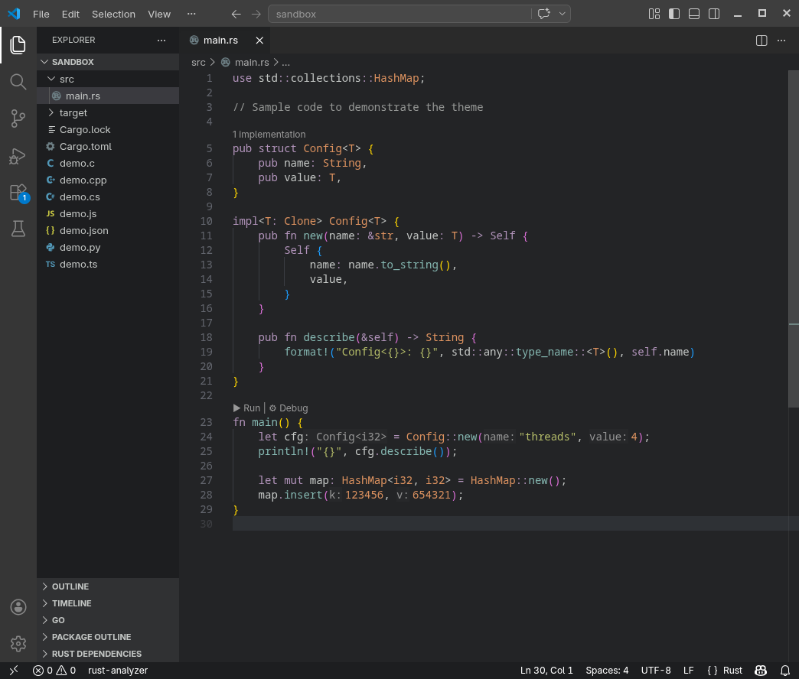
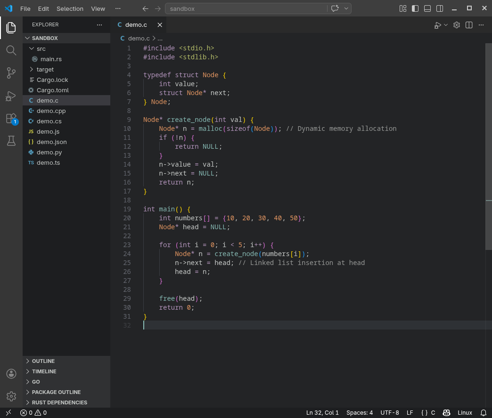
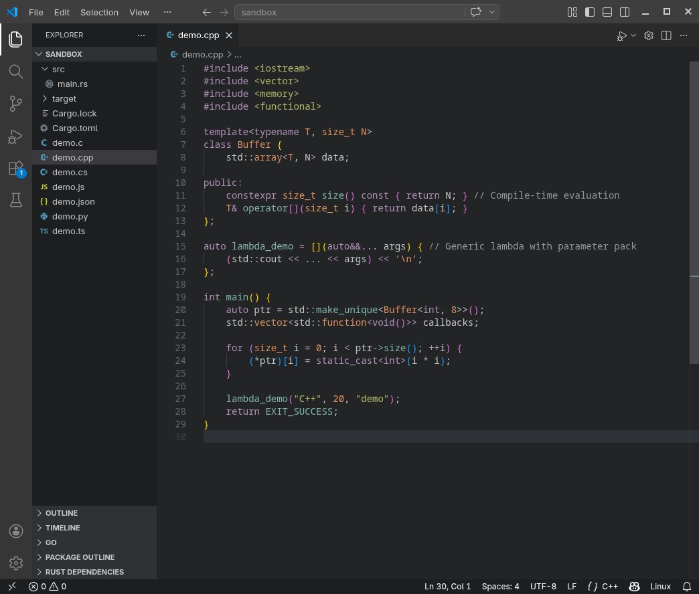
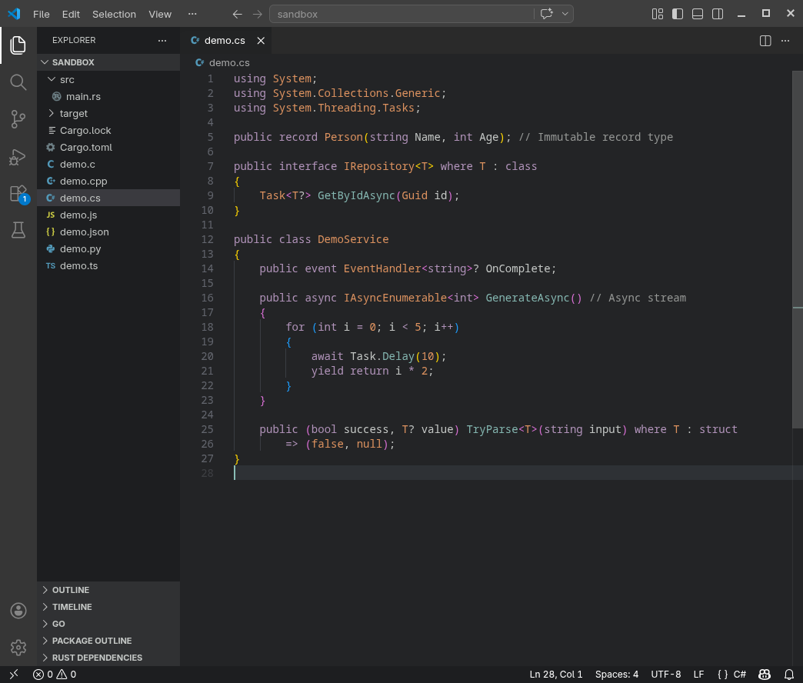
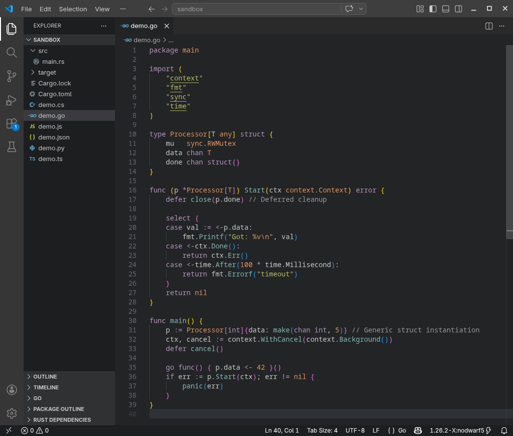
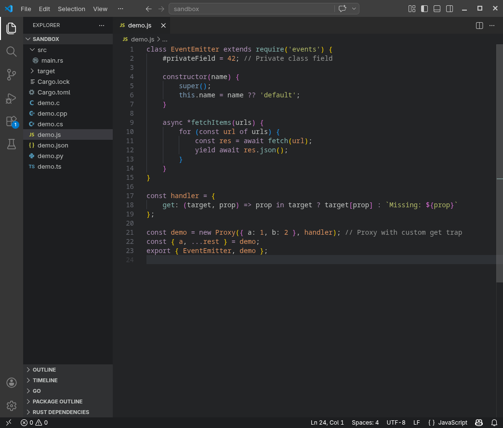
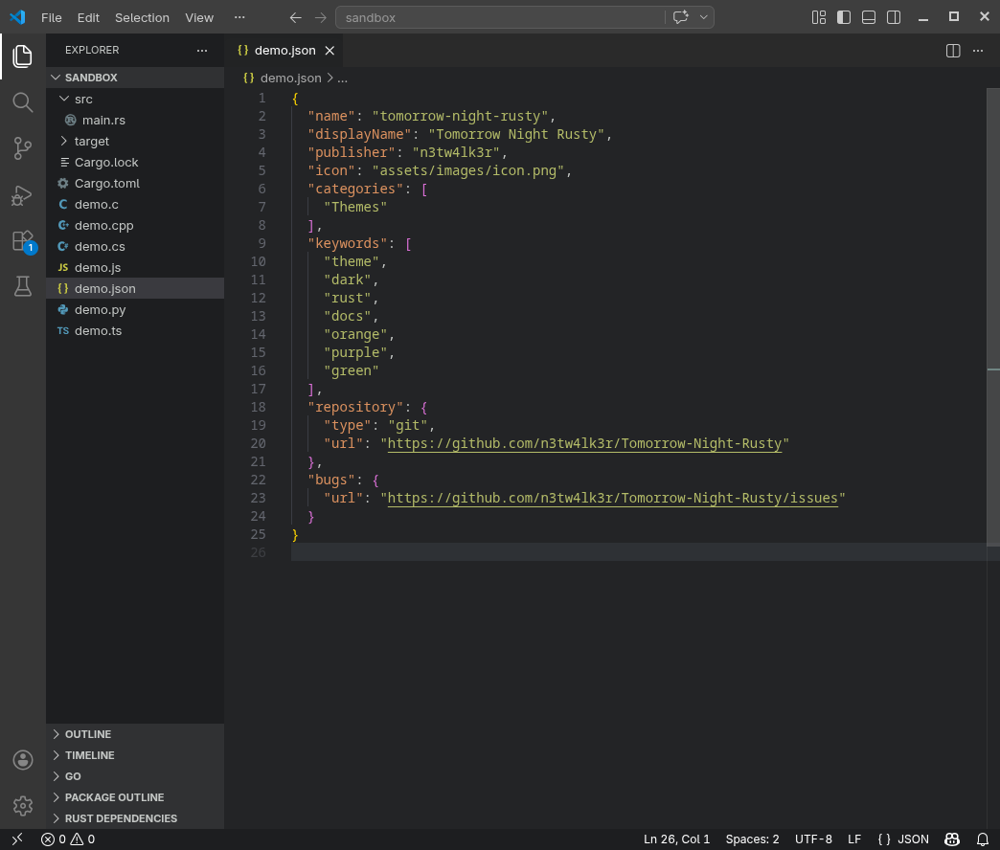
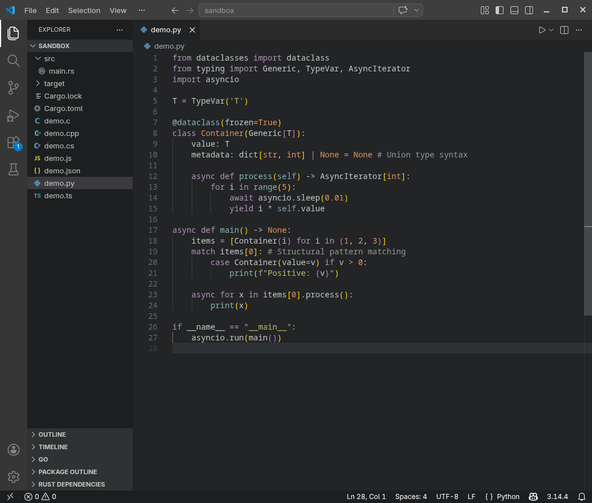
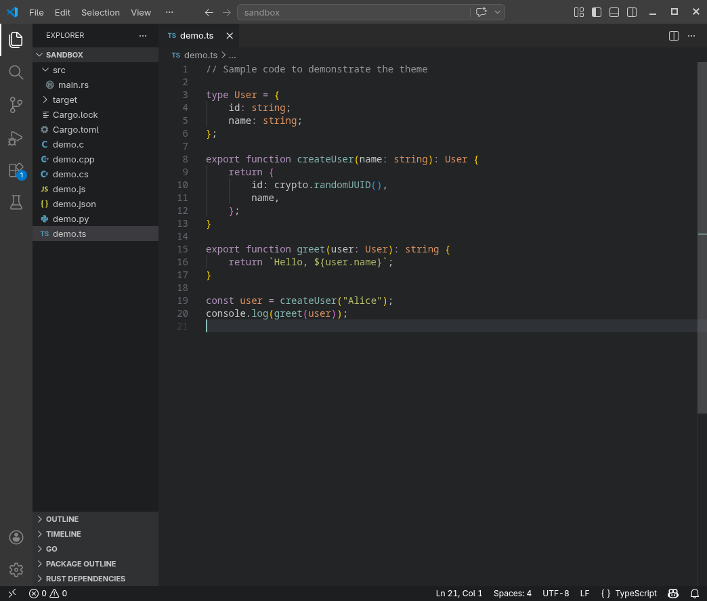

# Tomorrow Night Rusty 

A dark VS Code theme inspired by the color palette used in [Rust documentation](https://doc.rust-lang.org/book/) and [rusty.nvim](https://github.com/armannikoyan/rusty) theme, which itself is inspired by Tomorrow Night theme.

Designed for readability and consistent highlighting across languages, with a focus on clean contrast and balanced colors.

## Preview

### Rust


### C


### C++


### C#


### Go


### JavaScript


### JSON


### Python


### TypeScript



## Features
- Balanced contrast for long coding sessions
- Consistent syntax highlighting across languages
- Tuned for semantic highlighting

## Installation

### Install from VSCode
1. Open the **Extensions** sidebar in VS Code. `View → Extensions`
2. Search for `Tomorrow Night Rusty`, choose "Tomorrow Night Rusty"
3. Click **Install** to install it
4. Navigate to File > Preferences > Themes > Color Theme > **Tomorrow Night Rusty**

### Manual installation
Download the `.vsix` file from the latest release here:
https://github.com/n3tw4lk3r/Tomorrow-Night-Rusty/releases

Then:
1. Open the **Extensions** sidebar in VS Code. `View → Extensions`
2. Click `...` → `Install from VSIX...`
3. Select your downloaded .vsix file

## Recommended settings
For best results, enable semantic highlighting.

Add this line to your settings.json:

<kbd>Ctrl</kbd> + <kbd>Shift</kbd> + <kbd>P</kbd> > Preferences: Open User Settings (JSON)

```json
"editor.semanticHighlighting.enabled": true,
```

## Notes
This theme is an independent project and is not affiliated with the Rust project.

## Feedback
Issues and suggestions:
https://github.com/n3tw4lk3r/Tomorrow-Night-Rusty/issues

If you find this theme useful, consider leaving a rating in the VS Code Marketplace.
